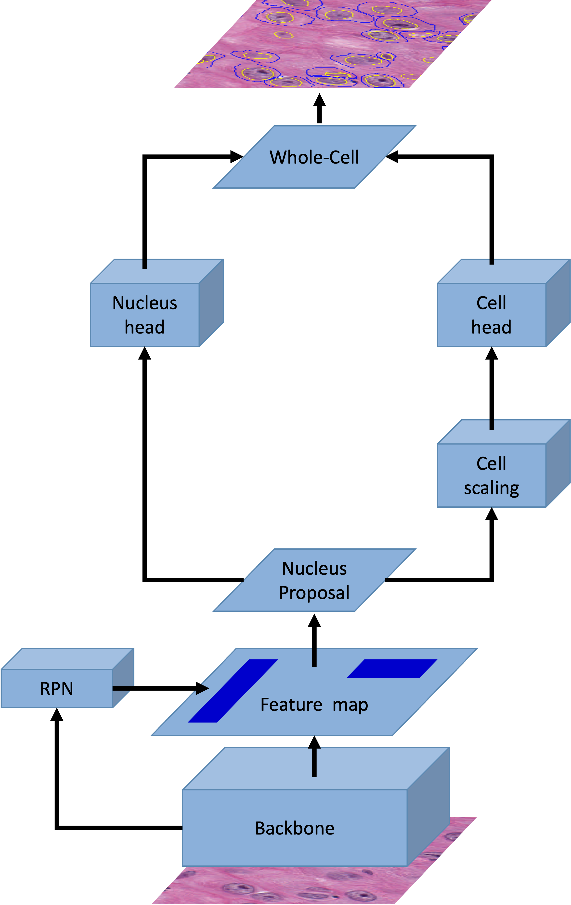

## Cyto R-CNN and CytoNuke Dataset: Towards reliable whole-cell segmentation in bright-field histological images

Work in progress. This repository will soon contain the Python implementation of [Cyto R-CNN](https://arxiv.org/abs/2401.15638).
<p align="center">

</p>

### Installation

First, you will need to install CUDA on your machine.
This code has been developed with Python 3.9 and CUDA 11.8.

1. `conda create -n cytorcnn python=3.9`
2. `conda activate cytorcnn`
3. Install an appropriate version of torch, torchvision and CUDA.
4. `pip install -r requirements.txt`
7. `pip install 'git+https://github.com/facebookresearch/detectron2.git'`
8. `pip install -e .`

### Usage

```python
## Prediction
weights_path = "/.../model.pth"
image_path = "/.../image.png"
cytorcnn = CytoRCNN(weights_path)
cytorcnn.predict(image_path)

## Training
train_images = "/.../train/images"
train_coco = "/.../train/coco.json"
train_dataset = Dataset(train_images, train_coco)

val_images = "/.../val/images"
val_coco = "/.../val/coco.json"
val_dataset = Dataset(val_images, val_coco)

# Optional: Register run in WeightsAndBiases
wandb.init(
    project="CytoRCNN"
)

cytorcnn = CytoRCNN()
cytorcnn.train(train_dataset, val_dataset)
```

### How to cite

```
@article{cytorcnn2024,
    title={Cyto R-CNN and CytoNuke Dataset: Towards reliable whole-cell segmentation in bright-field histological images}, 
    author={Johannes Raufeisen and Kunpeng Xie and Fabian Hörst and Till Braunschweig and Jianning Li and Jens Kleesiek and Rainer Röhrig and Jan Egger and Bastian Leibe and Frank Hölzle and Alexander Hermans and Behrus Puladi},
    year={2024},
    doi = {arXiv:2401.15638},
}
```
